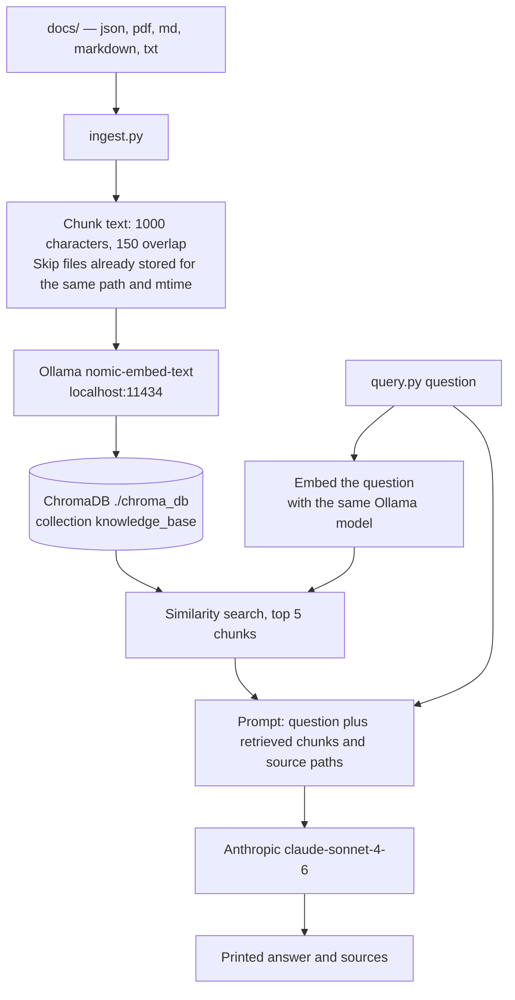

## Local RAG pipeline

For Dynamic and Time-Sensitive Information: Daily financial reports, stock market trends, or finance industry news updates ([financial-news-dataset](https://github.com/Webhose/financial-news-dataset) source)

The info gathering flow is currently a manual batch loading proccess by adding data in `docs` folder. [RAG Tutorial: Ask Questions About Your Documents](https://medium.com/@dejanualex/rag-tutorial-ask-questions-about-your-documents-a537c9242523) article.

⚠️ A RAG system makes the most sense for information that is **highly specific, proprietary, or constantly changing**


### Components

* Embeddings model: [nomic-embed-text embedding model from Ollama](https://ollama.com/library/nomic-embed-text-v2-moe)
* Vector DB: [ChromaDB](https://docs.trychroma.com/docs/overview/introduction)
* LLM (remote hosted Anthropic via API calls)


### Project setup for Python deps

```bash
# init project and add dependencies
uv init --name localRAG --python 3.14
uv add chromadb requests anthropic pypdf

# use project as is: install dependencies and update pyproject.toml
uv sync
```

On Apple Silicon, use **arm64** `uv` and **arm64** CPython (check with `file "$(which uv)"` and `file .venv/bin/python`). If you previously used x86_64 `uv`, it may have cached an x86_64 Python under `~/.local/share/uv/python/`; `uv sync` then fails on `onnxruntime` even after fixing `PATH`.

```bash
export PATH="$HOME/.local/bin:$PATH"   # arm64 uv from https://docs.astral.sh/uv/getting-started/installation/
uv python install 3.14.7               # downloads macos-aarch64 if needed
rm -rf .venv
uv sync
```

```bash
# cleanup uv project
rm -f pyproject.toml .python-version main.py .gitignore
rm -rf .venv
```

### Steps

* Start the embedding model:

```bash
docker run -d -v ollama:/root/.ollama -p 11434:11434 --name ollama ollama/ollama
docker exec -it ollama ollama pull nomic-embed-text
```

* Chunk and embed data from docs to vector DB:

    - Supports `json, pdf, md, markdown, txt`
    - re-run as new files are added to docs
    - vector data persists on disk in `./chroma_db`

```bash
# check chromadb
uv run check_db.py

# ingest data
uv run ingest.py docs/
```

* Start quering the knowledge base:

```bash
export ANTHROPIC_API_KEY=sk-ant-...
uv run query.py "What does the knowledge base say about X?"
```

### System diagram


